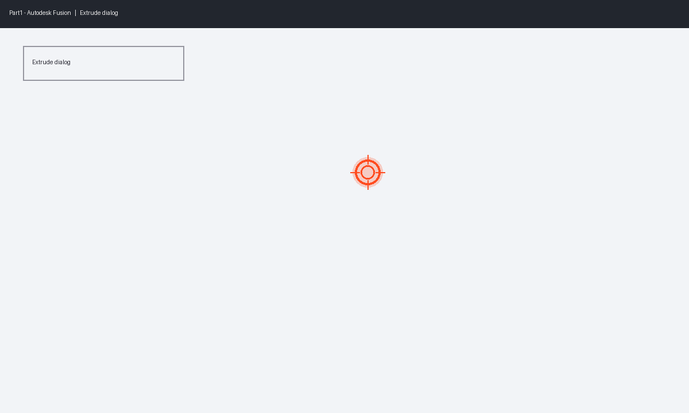

**Acme Manufacturing** — Mechanical Design

# How to Extrude a Boss in Fusion

_Standard operating procedure for the base flange_

**Author:** Jordan Lee | **Date:** 2026-06-24 | **Revision:** 1.0 | **Department:** Mechanical Design

---

## In Autodesk Fusion

**1.** Click at the highlighted location in Autodesk Fusion.

**2.** Click at the highlighted location in Autodesk Fusion.

**3.** Type `25 mm`.

**4.** Press **Enter**.

**5.** Verify the body shows in the timeline.
